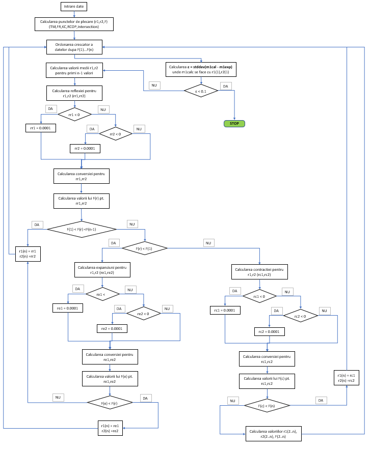

## PROCOP

## Introduction

This repository contains the work-in-progress reimplementations of optimzation programs in [Copolymerization: Toward a Systematic Approach](http://a.co/jg3TBim).

## Installation and Usage

1. Download and install Python 3 from the [offical website](https://www.python.org/downloads/). Be sure to enable Pip installation.
2. In a terminal, cmd, or PowerShell window type the following:
	
	pip install xlwt
	git clone https://github.com/alexhagiopol/PROCOP.git
	cd PROCOP

3. Run the program with the following command:

	python PROCOP.py

## System Diagram

