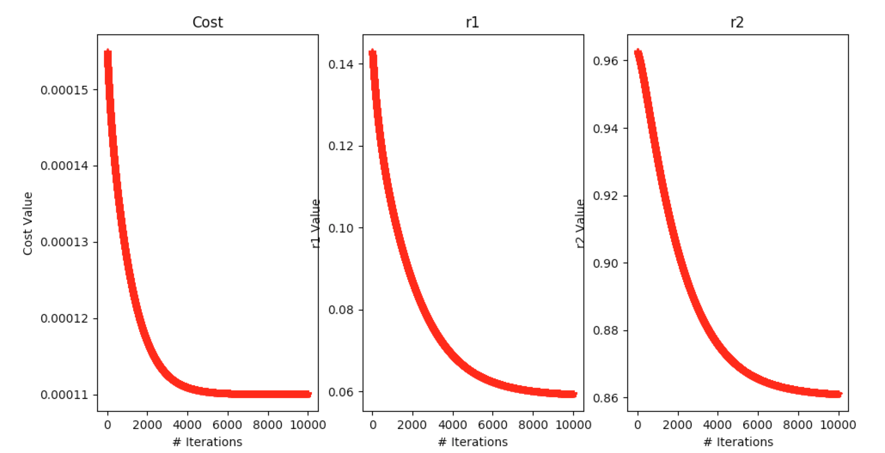

## PROCOP: 

This repository contains open sourced implementations of the software tools included with the
textbook [Copolymerization: Toward a Systematic Approach](http://a.co/3805acW) by Cornel Hagiopol.

### Reactvity Ratios Estimation with Gradient Descent:

The program `ReactivityRatios.py` estimates reactivity ratios `r1` and `r2` by applying gradient descent 
according to the paper [An Improved Method of Calculating Copolymerization Reactivity Ratios](https://onlinelibrary.wiley.com/doi/abs/10.1002/pol.1965.100030137)
by Paul Tidwell and George Mortimer. The notes below show the cost function derivatives and update rule implemented
in the code.

Running the program on the included `m1` and `M1` dataset in `data.csv` with input values 
`initial r1 = 0.143`, `initial r2 = 0.9626`, `iterations = 10000`, and `learning rate = 0.1`
yields the following cost value convergence and reactivity ratio estimate plot:

